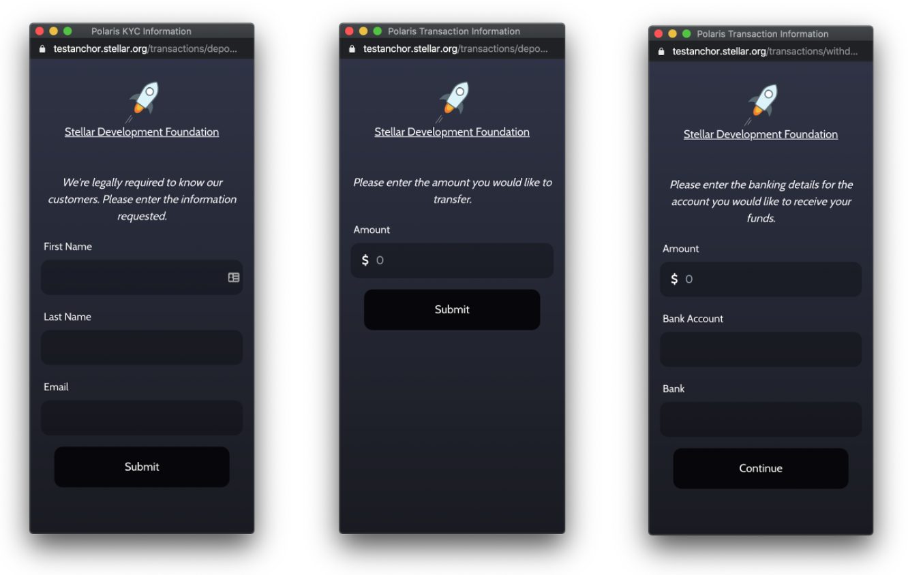
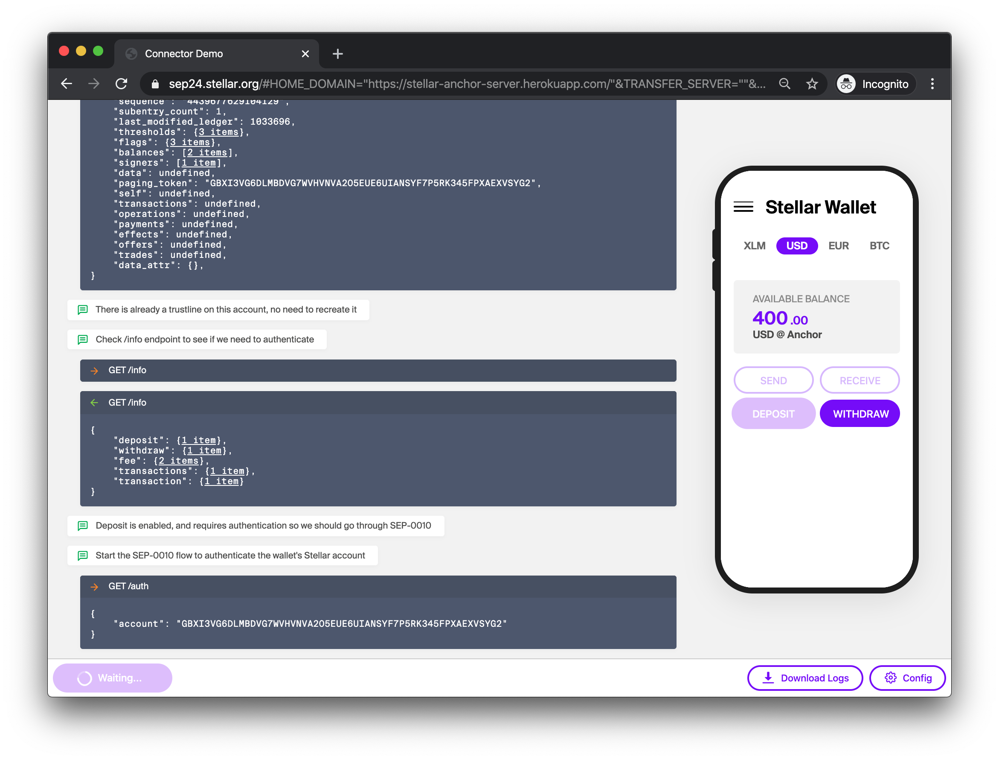

# reference-implementations

These docs walk through the steps necessary to set up and launch both a test server and a production server to handle deposits and withdrawals, but before you get any deeper, it's worth noting: you don't have to start from scratch. SDF offers some tools that make it easy to implement those servers, and test them from the client side.

## Anchor Server Reference Implementation

To help with server setup, SDF created [Polaris](https://github.com/stellar/django-polaris), an extendable django reusable-app that comes with fully-implemented endpoints, templates, and database models. It's built in Python using the community-supported [Stellar Python SDK](https://github.com/StellarCN/py-stellar-base), and is compliant with the Stellar Ecosystem Protocols mentioned in the previous section.

Polaris modularizes the parts of the codebase that interface with the Stellar network, and provides clear methods for developers to integrate their own deposit and withdrawal forms, KYC process, and banking rails connections. That means you can focus on implementing the business- and country-related aspects of your product without having to spend much time defining how to connect the server to the Stellar Network.

If you choose to use Polaris, you can jumpstart your deployment, and connect local rails to Stellar in weeks instead of months.

## Demo Client & Deployed Example

Once you have a server set up, SDF also maintains a [Demo Client Project](https://github.com/stellar/sep24-demo-client) that makes it easy to test your implementation on both the testnet and the pubnet.

We've even deployed a [Deployed Demo Client](https://sep24.stellar.org/), which allows you to run those tests with a UI without needing to set up a new hosting infrastructure for that project.

With the demo client, you can test your deposit and withdraw flows, and get information about the transactions that are created during those processes. It gives a clear step-by-step visual example of how the functionalities work along with insightful information about the requests, protocols, and possible validation messages. To start testing the deploys, simply update the settings of the Demo Client \(click the gear button on the bottom right\) to include your project's information.

## Anchor Validation Suite

The SEP-24 Anchor Validation Suite is a set of tests that helps confirming if your anchor implementation is compliant with the latest specifications of the SEP-24 standard. This is a great resource for people that are getting started building an anchor and want to check what's still missing in their implementation, or for teams that have already finalized the anchor development and want an extra validation on the codebase. Also, the Anchor Validation Suite doesn't replace the necessity of having a professional security auditor reviewing the whole project.

The SEP-24 Anchor Validation Suite codebase is available in an open-sourced [Github Repository](https://github.com/stellar/transfer-server-validator/), where you can check in details exactly how all tests work. SDF also maintains a [deployed version of the Validation Suite](http://anchor-validator.stellar.org/) with a UI for running the tests without the need to setup your own infrastructure. In order to also test the interactive parts of SEP-24, you'll need to add test values to all the required interactive flow fields. The [Github Repository Readme file](https://github.com/stellar/transfer-server-validator/#providing-field-values) has more information on how exactly those fields need to be added. Finally, you can also trigger the tests directly from a Continuous Integration tool \(like CircleCI or Jenkins\), in order to have continuous monitoring of your anchor infrastructure.

